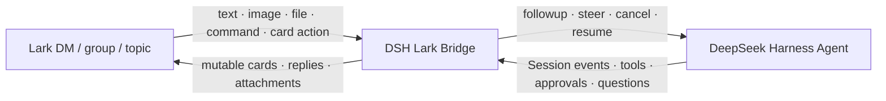

# DeepSeek Harness Lark Bridge

English | [中文](README.zh.md)

[](https://github.com/imetn/dsh-lark-bridge/actions/workflows/ci.yml)
[](LICENSE)
[](package.json)

Turn Lark/Feishu into a secure remote control surface for [DeepSeek Harness](https://github.com/deepseek-ai/deepseek-harness)—not merely a notification channel.

The Bridge maps Harness Projects and Sessions onto Lark chats and topics, streams execution into native interactive cards, and sends text, files, images, commands, approvals, and answers back to the same Agent.

> Validated against DeepSeek Harness `0.1.0-rc.6`. Harness is in developer preview and may introduce breaking changes; rerun this repository's checks and a live smoke test before upgrading.

## Why a Bridge?

- **Bidirectional control:** start, continue, steer, stop, resume, or inspect an Agent from Lark.
- **Project routing:** bind each group to one working directory, model route, access policy, and card preset.
- **Topic-native Sessions:** one topic/thread maps to one Harness Session by default; replies preserve context while a new topic starts cleanly.
- **Live V2 cards:** one card evolves from running to completed, blocked, cancelled, or failed.
- **Human in the loop:** resolve tool approvals and structured Agent questions without leaving Lark.
- **Media in both directions:** receive images/files and let the Agent safely deliver workspace Markdown, images, or files.
- **Adjustable signal density:** compact, standard, and developer card views suit different audiences.
- **Secure defaults:** deny-by-default allowlists, group mention gating, operator rechecks, deduplication, stale-event rejection, redaction, SSRF protection, and filesystem containment.
- **No public webhook:** the official Lark Node SDK uses a WebSocket long connection for messages and card callbacks.

The execution trajectory contains tool names and bounded, redacted summaries. The Bridge never exposes hidden model chain-of-thought.



## Projects and Sessions

The recommended model is:

| Lark concept | Harness concept | Recommended use |
| --- | --- | --- |
| Topic group | Project container | One group per codebase or durable workstream |
| Topic/thread | Session | One task or coherent conversation per topic |
| DM | Control plane | List and switch Projects, then work privately |
| Normal group | Project container | Each top-level mention starts a thread-scoped Session |

With the default `groupSessionScope: thread`:

- a topic and all replies under it share one Session;
- another topic in the same group gets another Session;
- a top-level message in a normal group becomes a new thread-scoped Session;
- every group is bound to exactly one Project, and duplicate chat bindings are rejected;
- DMs use `/project <id>` to select a Project, and each selected Project keeps its own Session identity.

Other scopes are available for compatibility: `sender` creates one Session per Project, group, and sender; `chat` deliberately shares one Session among every allowed group operator. Use `chat` only when shared context is intentional.

## Card views

Set a default globally or per Project with `cardPreset`, then change the current Session at runtime with `/view` or the card button.

| Preset | Intended audience | Visible detail |
| --- | --- | --- |
| `compact` | General users | Task, live/final output, elapsed time, essential actions |
| `standard` | Most teams | Compact view plus Project, model, recent tool names, tool count, aggregate tokens |
| `developer` | Developers/operators | Standard view plus cwd, Session ID, detailed tool summaries/durations, input/output/cache tokens |

## Requirements

- Node.js 22+.
- An installed DeepSeek Harness CLI, or a runnable official source checkout.
- A custom Lark/Feishu app with bot capability enabled.
- A working Harness model configuration. This plugin neither stores nor proxies the DeepSeek API key.

## Configure the Lark app

In the Lark Developer Console:

1. Enable the **Bot** capability.
2. Under **Events**, choose **long connection** and add `im.message.receive_v1`.
3. Under **Callbacks**, choose **long connection** and add `card.action.trigger`.
4. Optionally add `im.message.reaction.created_v1` under **Events** to stop tasks with a stop-class reaction.
5. Request the minimum permissions below and publish an app version.

| Purpose | Permission |
| --- | --- |
| Receive DMs | `im:message.p2p_msg:readonly` |
| Receive only group mentions | `im:message.group_at_msg:readonly` |
| Send messages and update cards as the bot | `im:message:send_as_bot` |
| Upload images and files | `im:resource` |
| Download user attachments, optional | `im:message:readonly` |
| Read cancellation reactions, optional | `im:message.reactions:read` |

Avoid permission to read every group message. `requireMention: true` plus the group-mention event covers the normal control flow.

Lark sends an event to one randomly selected live long connection. Run one Bridge instance per bot app; use separate apps for separate environments.

## Install

From GitHub:

```bash
dsh plugin --profile lark add github:imetn/dsh-lark-bridge
```

The repository commits built `lib/` artifacts and bundles the official Lark SDK, so Git installation needs no install-time build permission. Third-party licenses ship in `lib/THIRD_PARTY_NOTICES.txt`. Pin a reviewed commit in production:

```bash
dsh plugin --profile lark add github:imetn/dsh-lark-bridge#<commit-sha>
```

For local development:

```bash
git clone https://github.com/imetn/dsh-lark-bridge.git
cd dsh-lark-bridge
pnpm install --frozen-lockfile
pnpm run check
dsh plugin --profile lark add "$PWD"
```

When running an official Harness source checkout, replace `dsh` with `pnpm dsh` from the Harness repository root.

### Harness plugin discovery

This repository uses both official discovery surfaces:

- `package.json` declares `dsh.bundle.patch: "./cordis.patch.yml"`, so `dsh plugin add` automatically activates the bundle.
- The GitHub repository carries the official `dsh-plugin` Topic, so users can discover it through [github.com/topics/dsh-plugin](https://github.com/topics/dsh-plugin).

The package keyword `dsh-plugin` mirrors the repository Topic for registry and code search.

## Credentials and multi-project configuration

Pass app credentials through the process environment. Never commit them:

```bash
export DSH_LARK_APP_ID='cli_xxxxxxxxxxxxxxxx'
export DSH_LARK_APP_SECRET='xxxxxxxxxxxxxxxxxxxxxxxxxxxxxxxx'
```

Edit `~/.dsh/profiles/lark/cordis.patch.yml`. A later profile patch replaces the Bridge's entire `config`, so keep every non-default value together:

```yaml
- id: dsh-lark-bridge
  config:
    allowedOpenIds:
      - ou_owner_xxxxxxxxx
    requireMention: true
    groupSessionScope: thread
    defaultProjectId: web
    cardPreset: standard
    nativeImageInput: false
    progressCards: true
    provideUserQuestions: true
    enableApprovals: true
    projects:
      - id: web
        name: Web App
        chatIds:
          - oc_web_topic_group_xxxxxxxxx
        allowedOpenIds:
          - ou_owner_xxxxxxxxx
        cwd: /absolute/path/to/web-app
        workspaceRoot: /absolute/path/to/web-app
        inboundDir: .dsh-lark-bridge/inbox
        cardPreset: developer
      - id: ios
        name: iOS App
        chatIds:
          - oc_ios_topic_group_xxxxxxxxx
        cwd: /absolute/path/to/ios-app
        workspaceRoot: /absolute/path/to/ios-app
        inboundDir: .dsh-lark-bridge/inbox
        cardPreset: compact
```

The global and Project-specific user allowlists are restrictive intersections: when a Project list is non-empty, an operator must pass both. Project lists do not widen the global policy.

Safe ID bootstrap:

1. Leave the allowlists empty and start the Bridge.
2. Have the intended user send a DM or group mention.
3. Copy the rejected `sender` and `chat` IDs from the local log.
4. Add only those IDs and restart.

Do not enable `allowAllUsers` or `allowAllGroups` in production. Comma-separated environment allowlists are also supported:

```bash
export DSH_LARK_ALLOWED_OPEN_IDS='ou_xxx,ou_yyy'
export DSH_LARK_ALLOWED_CHAT_IDS='oc_xxx'
```

Validate the composed profile before starting:

```bash
dsh --profile lark --dump-config
dsh --profile lark
```

## Commands

In a group, mention the bot with every command while `requireMention` is enabled.

| Input | Behavior |
| --- | --- |
| Plain text or attachments | Follow up in the current Agent, creating a Session when needed |
| `/help`, `/start` | Show Bridge controls |
| `/status` | Show connection, Project, model, cwd, Session, and interaction state |
| `/new` | Create a fresh Session for the current origin |
| `/stop` | Cancel the running task |
| `/approve` / `/reject` | Resolve the current one-shot tool approval; text fallback for unavailable card callbacks |
| `/steer <text>` | Steer the most recent running Agent step |
| `/sessions` | List Sessions owned by the current Lark origin |
| `/resume <session-id>` | Resume a Session owned by the current Lark origin |
| `/projects` | List Projects available to the operator |
| `/project <id>` | Select a Project in DM; group bindings cannot be switched |
| `/view compact\\|standard\\|developer` | Change card density for the current Session |
| `/commands` | List native Harness commands |
| Any other `/command` | Forward to the Harness command registry |

Running cards include a stop button. Terminal cards include new-Session, status, and view controls. Approval cards are one-shot and also accept `/approve` or `/reject`; question cards support single choice, multiple choice, and free-text replies.

## Configuration reference

| Field | Default | Meaning |
| --- | ---: | --- |
| `allowedOpenIds` | `[]` | Bridge-wide user allowlist; all users are denied by default |
| `allowedChatIds` | `[]` | Legacy/single-Project group allowlist; Project `chatIds` are preferred |
| `allowAllUsers` / `allowAllGroups` | `false` | Development-only open-policy switches |
| `requireMention` | `true` | Require a bot mention in groups |
| `groupSessionScope` | `thread` | `thread` recommended; alternatives are `sender` and `chat` |
| `defaultProjectId` | first Project | Project selected initially in DM |
| `projects` | one `default` Project | Project bindings for chat, model, cwd, files, access, and card view |
| `provider` / `model` | Harness selection | Global model route; each Project may override it |
| `cwd` | process cwd | Global Agent working directory default |
| `workspaceRoot` | `cwd` | Outermost directory from which `lark_deliver` may send files |
| `inboundDir` | `.dsh-lark-bridge/inbox` | Private attachment directory inside `workspaceRoot` |
| `cardPreset` | `standard` | Global card density; each Project may override it |
| `nativeImageInput` | `false` | Also inject received images through the Harness attachment service |
| `progressCards` | `true` | Use one mutable live execution card per turn |
| `progressUpdateMs` | `1000` | Card update throttle, minimum 250 ms |
| `maxInboundFileBytes` | `20 MiB` | Per-attachment streaming limit |
| `maxOutboundFileBytes` | `30 MiB` | Per-file limit; long Markdown truncates on a UTF-8 boundary |
| `interactiveTimeoutMs` | `10 min` | Approval and question timeout |
| `provideUserQuestions` | `true` | Register the Lark question provider |
| `enableApprovals` | `true` | Route approvals for Lark-owned Sessions to Lark |
| `cardBodyMaxChars` | `12000` | Card output preview, from 1000 to 28000 characters |

Each Project supports `id`, `name`, `chatIds`, `allowedOpenIds`, `provider`, `model`, `cwd`, `workspaceRoot`, `inboundDir`, and `cardPreset`.

## Files and security

- Inbound attachments are stored as `0600` files under `0700` directories with sanitized names and random suffixes.
- With `nativeImageInput: false`, images reach the Agent as controlled local paths. When enabled, supported routes also receive a native Harness image attachment.
- `lark_deliver` accepts only regular files whose real path remains inside the current Project's `workspaceRoot`; symlink escapes are rejected.
- PNG, JPEG, GIF, and WebP are sent as images. Other formats are sent as files.
- Long card output spills to `deepseek-harness-response.md`; output beyond the file budget carries an explicit truncation marker.
- Operator identity and Project access are rechecked for cards, approvals, questions, and reactions.
- Secrets are redacted from model output, tool summaries, errors, cards, and spill files.
- Incoming events are deduplicated by message ID, stale messages are discarded, and each chat is serialized.
- A Lark approval button grants one operation only; it never changes Harness policy permanently.

See [SECURITY.md](SECURITY.md) for reporting and the complete trust model.

## Development

```bash
pnpm install --frozen-lockfile
pnpm run check
pnpm pack
```

`pnpm run check` runs TypeScript checking, 28 unit/contract tests, the production bundle, and an import check against the built Cordis plugin. Coverage includes official discovery metadata, Agent-scoped question tooling, approval fallbacks, configuration invariants, Project/topic identity, card actions, access intersections, attachment boundaries, UTF-8 spill limits, and the Loader export contract.

## Troubleshooting

- **Connected but no inbound messages:** publish the app version, select long connection, and add the message event plus matching permission.
- **No group response:** add the bot, mention it, and bind that group's `chat_id` to exactly one Project.
- **Card buttons do nothing:** add `card.action.trigger` under **Callbacks**, not the message event list, and allow the operator in both relevant allowlists. Until then, use `/approve` or `/reject` for approvals and plain text for questions.
- **Attachment download fails:** add `im:message:readonly` and check `maxInboundFileBytes`.
- **Wrong Project in DM:** run `/projects`, then `/project <id>`.
- **Unexpected shared or split context:** keep `groupSessionScope: thread` and reply inside the intended topic/thread.
- **Question provider conflict:** set `provideUserQuestions: false`, or remove the other provider.
- **Intermittent state with multiple processes:** leave one Bridge connected to an app, or split environments across apps.

## License

[MIT](LICENSE) © Ethan Zhao
