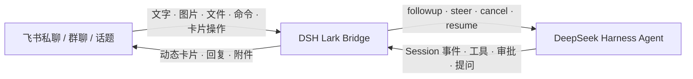

# DeepSeek Harness Lark Bridge

[English](README.md) | 中文

[](https://github.com/imetn/dsh-lark-bridge/actions/workflows/ci.yml)
[](LICENSE)
[](package.json)

把飞书变成 [DeepSeek Harness](https://github.com/deepseek-ai/deepseek-harness) 的安全远程控制面，而不只是一条通知通道。

Bridge 将 Harness 的 Project 与 Session 映射到飞书群聊和话题，把实时执行过程呈现为原生交互卡片，也把文字、文件、图片、命令、审批和回答送回同一个 Agent。

> 当前版本已针对 DeepSeek Harness `0.1.0-rc.6` 验证。Harness 仍处于开发者预览阶段，可能发生破坏性变更；升级前请重新运行本仓库检查与真实联调。

## 为什么叫 Bridge

- **双向控制**：可从飞书创建、继续、纠偏、停止、恢复和检查 Agent。
- **Project 路由**：每个群可绑定独立工作目录、模型路线、访问策略和卡片视图。
- **话题即 Session**：默认一个话题/线程对应一个 Harness Session；同话题回复延续上下文，新话题从新会话开始。
- **实时 V2 卡片**：一张卡片从运行中原位更新为完成、阻塞、取消或失败。
- **人在回路**：不离开飞书即可处理工具审批和 Agent 结构化提问。
- **双向媒体**：接收图片与文件，也允许 Agent 安全投递工作区内的 Markdown、图片或文件。
- **可调信息密度**：精简、标准、开发者三种视图适配不同用户。
- **安全默认值**：默认拒绝、群聊强制 `@`、交互身份复核、去重、过期事件拒绝、脱敏、SSRF 防护与文件系统边界。
- **无需公网 Webhook**：使用飞书官方 Node SDK WebSocket 长连接接收消息和卡片回调。

执行轨迹只展示工具名称与受长度限制、已脱敏的摘要，不会暴露模型隐藏思维链。



## Project 与 Session 最佳实践

推荐采用下面的映射：

| 飞书实体 | Harness 实体 | 推荐用途 |
| --- | --- | --- |
| 话题群 | Project 容器 | 一个代码库或长期工作流一个群 |
| 话题/线程 | Session | 一个任务或一段完整对话一个话题 |
| 机器人私聊 | 控制面 | 查看、切换 Project，再进行私密操作 |
| 普通群 | Project 容器 | 每条顶层 `@机器人` 消息开启一个线程 Session |

默认 `groupSessionScope: thread` 时：

- 一个话题及其全部回复共享一个 Session；
- 同群另一个话题获得另一个 Session；
- 普通群中的顶层消息会成为一个新的线程 Session；
- 每个群必须且只能绑定一个 Project，重复绑定会在启动时被拒绝；
- 私聊通过 `/project <id>` 选择 Project，不同 Project 保留各自的 Session 身份。

还可选择兼容模式：`sender` 按“Project + 群 + 发送者”建立 Session；`chat` 让群内全部获准操作者共享一个 Session。只有在确实需要共享上下文时才使用 `chat`。

## 卡片信息密度

用 `cardPreset` 设置全局或 Project 默认值，再通过 `/view` 或完成卡片按钮切换当前 Session。

| 视图 | 适合人群 | 展示内容 |
| --- | --- | --- |
| `compact` | 普通用户 | 任务、实时/最终结果、耗时、关键操作 |
| `standard` | 大多数团队 | 精简内容 + Project、模型、近期工具名、工具次数、汇总 token |
| `developer` | 开发者/运维 | 标准内容 + cwd、Session ID、工具摘要与耗时、输入/输出/缓存 token |

## 前置条件

- Node.js 22 或更高版本。
- 已安装的 DeepSeek Harness CLI，或一份可运行的官方源码 checkout。
- 一个已启用机器人能力的飞书/Lark 自建应用。
- 可用的 Harness 模型配置。插件不持有、代理或保存 DeepSeek API Key。

## 配置飞书应用

在飞书开放平台完成以下设置：

1. 启用 **机器人** 能力。
2. 在 **事件配置** 中选择 **使用长连接接收事件**，添加 `im.message.receive_v1`。
3. 在 **回调配置** 中选择 **使用长连接接收回调**，添加 `card.action.trigger`。
4. 如需用停止类表情取消任务，可在 **事件配置** 中增加 `im.message.reaction.created_v1`。
5. 按下表申请最小权限，并发布一个应用版本。

| 用途 | 权限 |
| --- | --- |
| 接收私聊 | `im:message.p2p_msg:readonly` |
| 群聊中仅接收 `@机器人` 的消息 | `im:message.group_at_msg:readonly` |
| 机器人发送消息与更新卡片 | `im:message:send_as_bot` |
| 上传图片和文件 | `im:resource` |
| 下载用户附件，可选 | `im:message:readonly` |
| 读取取消表情，可选 | `im:message.reactions:read` |

不要为了省事申请“读取群内全部消息”；`requireMention: true` 与群聊 `@` 事件已经覆盖正常控制流程。

飞书会把同一事件随机交给某一个在线长连接。一个机器人应用建议只运行一个 Bridge 实例；多环境应拆分为不同应用。

## 安装

从 GitHub 安装：

```bash
dsh plugin --profile lark add github:imetn/dsh-lark-bridge
```

仓库提交了已构建的 `lib/`，并把飞书官方 SDK 打入运行包，因此 Git 安装无需执行安装期构建脚本。第三方许可证随 `lib/THIRD_PARTY_NOTICES.txt` 交付。生产环境建议锁定已审查的 commit：

```bash
dsh plugin --profile lark add github:imetn/dsh-lark-bridge#<commit-sha>
```

本地开发：

```bash
git clone https://github.com/imetn/dsh-lark-bridge.git
cd dsh-lark-bridge
pnpm install --frozen-lockfile
pnpm run check
dsh plugin --profile lark add "$PWD"
```

若从 DeepSeek Harness 源码运行，把上述 `dsh` 替换为 Harness 仓库根目录下的 `pnpm dsh`。

### Harness 插件发现

本仓库同时使用官方要求的两个入口：

- `package.json` 声明 `dsh.bundle.patch: "./cordis.patch.yml"`，使 `dsh plugin add` 安装后自动激活 Bridge。
- GitHub 仓库设置官方 `dsh-plugin` Topic，使用户可从 [github.com/topics/dsh-plugin](https://github.com/topics/dsh-plugin) 发现本项目。

包关键词也包含 `dsh-plugin`，便于注册表和代码搜索。

## 凭据与多 Project 配置

通过进程环境传入应用凭据，绝不要提交：

```bash
export DSH_LARK_APP_ID='cli_xxxxxxxxxxxxxxxx'
export DSH_LARK_APP_SECRET='xxxxxxxxxxxxxxxxxxxxxxxxxxxxxxxx'
```

编辑 `~/.dsh/profiles/lark/cordis.patch.yml`。后应用的 profile patch 会整体替换 Bridge 的 `config`，因此请把所有非默认值写在同一处：

```yaml
- id: dsh-lark-bridge
  config:
    allowedOpenIds:
      - ou_owner_xxxxxxxxx
    requireMention: true
    groupSessionScope: thread
    defaultProjectId: web
    cardPreset: standard
    nativeImageInput: false
    progressCards: true
    provideUserQuestions: true
    enableApprovals: true
    projects:
      - id: web
        name: Web App
        chatIds:
          - oc_web_topic_group_xxxxxxxxx
        allowedOpenIds:
          - ou_owner_xxxxxxxxx
        cwd: /absolute/path/to/web-app
        workspaceRoot: /absolute/path/to/web-app
        inboundDir: .dsh-lark-bridge/inbox
        cardPreset: developer
      - id: ios
        name: iOS App
        chatIds:
          - oc_ios_topic_group_xxxxxxxxx
        cwd: /absolute/path/to/ios-app
        workspaceRoot: /absolute/path/to/ios-app
        inboundDir: .dsh-lark-bridge/inbox
        cardPreset: compact
```

全局与 Project 用户白名单是限制性交集：Project 白名单非空时，操作者必须同时通过两层检查；Project 白名单不会放宽全局策略。

安全获取 ID 的方式：

1. 保持白名单为空并启动 Bridge。
2. 让目标用户发送一条私聊或群聊 `@` 消息。
3. 从本地拒绝日志复制 `sender` 与 `chat` ID。
4. 只加入这些 ID，然后重启。

生产环境不要启用 `allowAllUsers` 或 `allowAllGroups`。也可用环境变量补充逗号分隔的白名单：

```bash
export DSH_LARK_ALLOWED_OPEN_IDS='ou_xxx,ou_yyy'
export DSH_LARK_ALLOWED_CHAT_IDS='oc_xxx'
```

启动前验证组合后的 profile：

```bash
dsh --profile lark --dump-config
dsh --profile lark
```

## 飞书命令

启用 `requireMention` 时，在群内发送每条命令都需要 `@机器人`。

| 输入 | 行为 |
| --- | --- |
| 直接发送文字或附件 | 继续当前 Agent；没有 Session 时自动创建 |
| `/help`、`/start` | 显示 Bridge 控制说明 |
| `/status` | 查看连接、Project、模型、cwd、Session 与交互状态 |
| `/new` | 为当前来源创建全新 Session |
| `/stop` | 取消当前任务 |
| `/steer <内容>` | 在任务运行中把补充或纠正送到最近一步 |
| `/sessions` | 列出属于当前飞书来源的历史 Session |
| `/resume <session-id>` | 恢复属于当前飞书来源的 Session |
| `/projects` | 列出操作者可使用的 Project |
| `/project <id>` | 在私聊中选择 Project；群聊绑定不可切换 |
| `/view compact\|standard\|developer` | 切换当前 Session 的卡片密度 |
| `/commands` | 列出 Harness 原生命令 |
| 其他 `/命令` | 转发给 Harness 命令注册表 |

运行卡片带“停止任务”；完成卡片带“新会话”“查看状态”和视图切换。审批卡片只生效一次；提问卡片支持单选、多选与直接文字回答。

## 配置参考

| 字段 | 默认值 | 说明 |
| --- | ---: | --- |
| `allowedOpenIds` | `[]` | Bridge 全局用户白名单；默认拒绝全部用户 |
| `allowedChatIds` | `[]` | 兼容单 Project 的群白名单；多 Project 推荐使用 `chatIds` |
| `allowAllUsers` / `allowAllGroups` | `false` | 仅建议隔离开发环境使用的开放策略 |
| `requireMention` | `true` | 群聊必须 `@机器人` |
| `groupSessionScope` | `thread` | 推荐 `thread`；还可选 `sender`、`chat` |
| `defaultProjectId` | 第一个 Project | 私聊初始选中的 Project |
| `projects` | 一个 `default` Project | 群绑定、模型、cwd、文件、权限与卡片视图 |
| `provider` / `model` | Harness 当前选择 | 全局模型路线；每个 Project 可覆盖 |
| `cwd` | 启动目录 | 全局 Agent 工作目录默认值 |
| `workspaceRoot` | `cwd` | `lark_deliver` 可发送文件的最外层目录 |
| `inboundDir` | `.dsh-lark-bridge/inbox` | 位于 `workspaceRoot` 内的附件私有目录 |
| `cardPreset` | `standard` | 全局卡片信息密度；每个 Project 可覆盖 |
| `nativeImageInput` | `false` | 同时通过 Harness 附件服务注入收到的图片 |
| `progressCards` | `true` | 每轮使用一张可更新的实时执行卡片 |
| `progressUpdateMs` | `1000` | 卡片更新节流，最小 250 ms |
| `maxInboundFileBytes` | `20 MiB` | 单附件流式接收上限 |
| `maxOutboundFileBytes` | `30 MiB` | 单文件上限；长 Markdown 按 UTF-8 边界截断 |
| `interactiveTimeoutMs` | `10 min` | 审批与提问等待时间 |
| `provideUserQuestions` | `true` | 注册飞书提问 provider |
| `enableApprovals` | `true` | 把飞书 Session 的工具审批发送到飞书 |
| `cardBodyMaxChars` | `12000` | 卡片结果预览字符数，范围 1000–28000 |

每个 Project 支持 `id`、`name`、`chatIds`、`allowedOpenIds`、`provider`、`model`、`cwd`、`workspaceRoot`、`inboundDir` 与 `cardPreset`。

## 文件与安全

- 入站附件保存为 `0600` 文件，目录权限为 `0700`；文件名会被净化并添加随机后缀。
- `nativeImageInput: false` 时，图片以受控本地路径交给 Agent；启用后，支持的模型路线还会收到 Harness 原生图片附件。
- `lark_deliver` 只允许发送当前 Project `workspaceRoot` 内的普通文件；解析真实路径后拒绝符号链接逃逸。
- PNG、JPEG、GIF、WebP 作为图片发送，其他格式作为普通文件发送。
- 卡片输出超限时附加 `deepseek-harness-response.md`；超过文件预算会带明确截断标记。
- 卡片、审批、提问和 reaction 都会重新校验操作者身份与 Project 权限。
- 模型输出、工具摘要、错误、卡片与溢出文件在发送前统一脱敏。
- 入站事件按消息 ID 去重，拒绝过期事件，并按聊天串行处理。
- 飞书审批按钮只授权当前一次操作，不会永久改变 Harness 策略。

完整信任模型与漏洞报告方式见 [SECURITY.md](SECURITY.md)。

## 开发与验证

```bash
pnpm install --frozen-lockfile
pnpm run check
pnpm pack
```

`pnpm run check` 会执行 TypeScript 检查、26 项单元/契约测试、生产构建，以及对构建后 Cordis 插件的真实导入检查。覆盖官方发现元数据、配置不变量、Project/话题身份、卡片操作、权限交集、附件边界、UTF-8 文件上限和 Loader 导出契约。

## 故障排查

- **已连接但收不到消息**：确认应用版本已发布、使用长连接，并添加消息事件与对应权限。
- **群聊无响应**：确认机器人已入群、消息中 `@机器人`，且该群 `chat_id` 只绑定到一个 Project。
- **卡片按钮无响应**：在 **回调配置** 而不是事件列表中添加 `card.action.trigger`，并确认操作者通过两层白名单。
- **附件接收失败**：确认有 `im:message:readonly`，并检查 `maxInboundFileBytes`。
- **私聊进入了错误 Project**：先发送 `/projects`，再发送 `/project <id>`。
- **上下文意外共享或分裂**：保留 `groupSessionScope: thread`，并在目标话题/线程内回复。
- **提问 provider 冲突**：设置 `provideUserQuestions: false`，或移除另一个 provider。
- **多实例时状态偶发异常**：同一应用只保留一个在线 Bridge，或按环境拆分应用。

## 许可证

[MIT](LICENSE) © Ethan Zhao
